## 实验5 图书管理系统

### 1. 实验目的

+ 设计并实现一个精简的图书管理程序, 要求具有图书入库、查询、借书、还书、借书证管理等功能。
+ 通过本实验，提高学生的系统编程能力，加深对数据库系统原理及应用的理解。

### 2. 实验环境

+ Windows10 x64物理机
+ 数据库管理系统：MySQL
+ 集成开发环境：Visual Studio 2017

### 3.功能设计

#### 3.1 基本数据对象

对象名称 | 包含属性
:-:|:-:
书 | <u>书号</u>，书名，类别，出版社，年份，作者，价格，总藏书量，库存 
借书证 | <u>卡号</u>，姓名，单位，类别 (教师或者学生) 
借书记录 | <u>卡号，借书证号，借期</u>，还期 

#### 3.2 基本功能模块

##### 3.2.1 图书查询搜索

要求可以对书的类别, 书名, 出版社, 年份, 作者, 价格进行查询. 并列出符合条件的图书，每条图书信息包括以下内容:

<center><b>(书号, 类别,书名,出版社,年份,作者,价格,总藏书量,库存)</b></center>

`NOTICE`: 

+ 价格和年份支持区间查询。凡是落在[min, max]都满足筛选条件。

+ 所有属性支持模糊查询。凡是用户不了解细节的属性，允许用户不予筛选。

  

##### 3.2.2 图书入库

要求实现两种图书入库方式，**人工入库**和**从文件批量入库**，每次入库图书时系统需要用户提供书的以下属性：

<center><b>(书号,书名,类别,出版社,年份,作者,价格,数量)</b></center>

如果当前书号在图书库中不存在，则将当前图书作为新书入库。新书的库存总量和余量为用户输入的数量；如果当前书号在图书库中存在，则更新当前图书的库存总量和余量。

**人工入库**：要求用户从控制台提供书的相关属性信息。

**从文件批量入库**：要求用户提供数据格式正确的文件路径。文件的每一行格式应该如下：

<center><b>书号, 书名, 类别, 出版社, 年份, 作者, 价格, 数量</b></center>

图书管理系统执行该功能模块后，要求其返回相关操作信息。对于每一本尝试入库的图书，要求其提示是否入库成功。若入库成功，则提示此书是被插入（此前图书馆不存在此书）还是被更新库存信息（此前图书馆已经存在此书）；若入库不成功，要求提示错误信息。

`NOTICE`：图书管理程序不对**数量为0**的图书尝试入库报错。但这是一个未定义的行为，笔者强烈不提倡该行为。


##### 3.2.3 借书

借书分为两个过程：**输入借书证卡号**和**输入图书书号**。

**输入借书证卡号**：由用户从控制台输入借书证卡号。若此卡号存在，打印出该卡正在借阅的图书，并进入下一个过程；若此卡号不存在，则提示错误信息，返回到功能选择界面。

**输入图书书号**：由用户从控制台输入图书书号。若此图书不存在，提示图书不存在的错误信息；否则，若此图书已经被该用户借阅，提示不能借阅多本的信息；否则，若此图书没有余量，打印关于此图书的所有未归还借书记录；否则，提示借阅图书成功，更新图书库存并更新借书记录。

`NOTICE`：

+ 对于某一本书每个用户，至多借一本。

+ 由于未规定每一本书至多借阅时间，因此更新借书记录时，只记录借书日期而不记录还书日期。

+ 若某本书已经没有余量，说明全部都在被借阅。且借阅时间越早归还可能越大（笔者认为这十分合理），因此用户可根据系统给出的该书借阅记录进行考虑分析。

  

##### 3.2.4 还书

还书分为两个过程：**输入借书证卡号**和**输入图书书号**。

**输入借书证卡号**：由用户从控制台输入借书证卡号。若此卡号存在，打印出该卡正在借阅的图书，并进入下一个过程；若此卡号不存在，则提示错误信息，返回到功能选择界面。

**输入图书书号**：由用户从控制台输入图书书号。若此图书不在用户所借阅的图书中，提示错误信息；否则，提示还书成功，更新对应图书库存并更新借书记录的还书日期。


##### 3.2.5 借书证管理

管理分为两个过程：**输入借书证卡号**和**输入要修改的信息**。

**输入借书证卡号**：由用户从控制台输入借书证卡号。若此卡不存在报错；否则，打印出该卡的如下属性信息：

<center><b>（卡号，持有者姓名，持有者学院，持有者身份）</b></center>

**输入修改信息**：由用户根据程序提示输入相关属性信息（卡号作为PK不能修改），若修改失败则报错。


##### 3.2.6 借书证增删

由用户选择增加或者删除借书证。若选择增加借书证，则用户需要提供卡的如下属性信息：

<center><b>（卡号，持有者姓名，持有者学院，持有者身份）</b></center>

若创建失败程序将提示错误信息。若选择删除借书证，则用户需要提供对应卡的卡号，若删卡失败则报错。

`NOTICE`：

+ 持有者身份只能是`student`或者`teacher`。

+ 删除借书证时，请先确保该借书证借阅的图书已经全部归还，否则将删除失败。

  

##### 3.2.7 查询借书记录

输入借书证卡号，打印该卡所有的借书记录（包括借书日期和还书日期）。

##### 3.2.8 列出所有图书

相当于无任何筛选条件的图书查询，测试用。


#### 3.3 系统结构设计

##### 3.3.1 实体关系图

<center>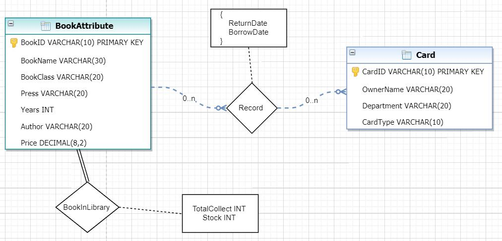</center>

##### 3.3.2 关键数据模式定义

+ Book -- 书

```mysql
create table Book (
	BookID varchar(10),
	BookName varchar(30),
    BookClass varchar(30),
    Press varchar(30),
    Years int,
    Author varchar(20),
    Price numeric(8,2),
    TotalCollect int,
    Stock int,
    primary key(BookID,BookName,BookClass,Press,
                Years,Author,Price,TotalCollect,Stock)
);
```

+ Card -- 借书证

```mysql
create table Card (
	CardID varchar(10),
	OwnerName varchar(20),
	Department varchar(30),
	CardType varchar(10),
    primary key(CardID,OwnerName,Department,CardType),
	check(CardType in('teacher','student'))
);
```

`NOTICE #1`：在Card和Book中都使用了大部分属性作为联合主键，而不采用单独的ID作为主键，这是考虑到图书入库和创建借书证操作。如果单独将ID作为主键，虽然用户输入了新的ID，如果其他属性都是一样，那就会出现同一本书，两个ID的情况，借书证也是如此，笔者认为这是不科学的。因此干脆加强了主键的约束。

+ Record -- 借书记录

```mysql
create table Record (
	CardID varchar(10),
	BookID varchar(10),
	BorrowDate varchar(25),
	ReturnDate varchar(25),
	primary key (CardID, BookID, BorrowDate),
	foreign key fk_cid(CardID) references Card(CardID),
	foreign key fk_bid(BookID) references Book(BookID)
);
```

`NOTICE #2`：此处将**CardID, BookID, BorrowDate**作为联合主键，这是因为一张借书卡可能在不同时间段多次借阅归还同一本书，所以需要额外的借书日期作为标识。至于为什么不在归还图书后马上从借书记录中删除该条记录（这样就不用三个属性成为联合主键），是因为设计需要给出某张借书证的所有借书记录。


### 4 难点实现和实验过程

#### 4.1 搭建ODBC环境

##### 4.1.1 配置ODBC MySQL Connector

由于笔者在Visual Studio 2017中使用C++进行图书管理系统的开发，因此适配的是ODBC（Open Database Connectivity）。虽然ODBC已经安装完毕，但是它并没有适配MySQL。因此需要去MySQL官网进行[下载](https://dev.mysql.com/downloads/connector/odbc/)。下载完毕并安装后，打开ODBC数据源，进行如下配置（这里是32位和64位都进行了配置）。

<center>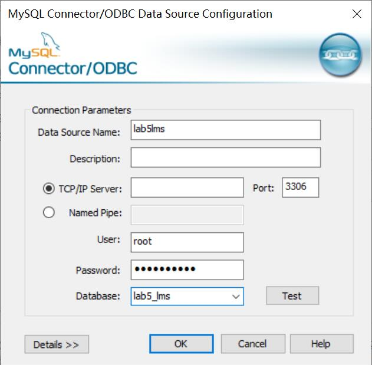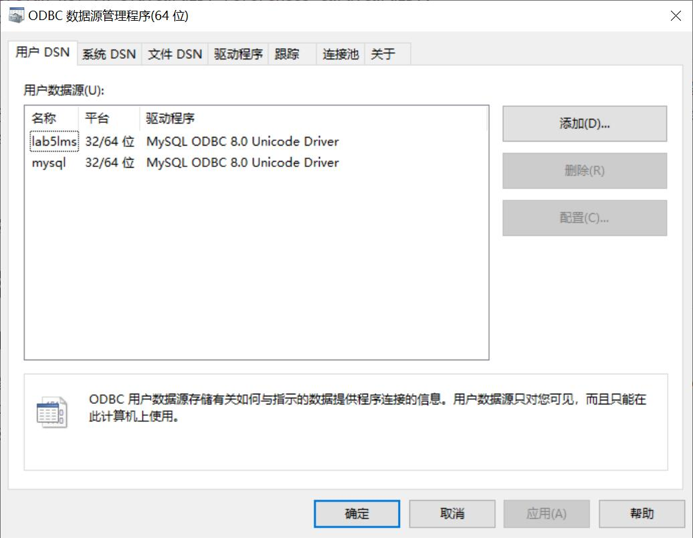</center>

##### 4.1.2 测试ODBC连接

配置完毕后，新建C++工程，检测是否可以正常连接到MySQL数据库（笔者创建的数据库名称为`lab5_lms`, ODBC连接名称为`lab5lms`)。连接测试代码如下：

```c++
#include <Windows.h>
#include <sql.h>
#include <sqlext.h>
#include <sqltypes.h>
#include <odbcinst.h>
#include <odbcss.h>
#include <iostream>
using namespace std;
#define MaxConfigStrLen 15
int main() {
	SQLRETURN	mRet = SQL_SUCCESS;
	SQLHENV		mEnv = nullptr;
	SQLHDBC		mConn = nullptr;
	SQLCHAR		mServerName[MaxConfigStrLen] = "lab5lms";
	SQLCHAR		mUserName[MaxConfigStrLen] = "root";
	SQLCHAR		mPassword[MaxConfigStrLen] = "fxfx123123";
    SQLAllocEnv(&mEnv);
	SQLAllocConnect(mEnv, &mConn);
    mRet = SQLConnect(mConn,
		mServerName, SQL_NTS,
		mUserName, SQL_NTS,
		mPassword, SQL_NTS);
    if (SQL_SUCCEEDED(mRet)) {
        cout << "success!" << endl;
        SQLDisconnect(mConn);
		SQLFreeConnect(mConn);
		SQLFreeEnv(mEnv);
    }
    return 0;
}
```


#### 4.2 ODBC数据交互

由于ODBC是微软实现的，而众所周知，微软的代码一直风格迷幻。笔者在设计图书管理程序时，曾经碰到了一系列难题，现在在这里逐个分享并解答，如需参照更多细节，请参照MSDN文档。

##### 4.2.1 读取SQL中的`decimal`/`numeric`数值到C的`float`

在SQL中定义decimal类型时，一般会指明它的精度(precision)和位数(scale)。比如：

```mysql
Price decimal(8,2) #precision=8, scale=2
```

如果想要将这样的数据读取到C语言的float变量中，而依然想用`SQLBindCol`的方式，则需要用到以下代码：

```c++
int RawLinker::GetFloat(int coln, float& tgt)
{
	SQLINTEGER len;
	SQLHDESC hdesc = NULL;
	SQLGetStmtAttr(mStatement, SQL_ATTR_APP_ROW_DESC, &hdesc, 0, NULL);
	SQLSetDescField(hdesc, coln, SQL_DESC_TYPE, (SQLPOINTER)SQL_C_NUMERIC, 0);
	SQLSetDescField(hdesc, coln, SQL_DESC_PRECISION, (SQLPOINTER)8, 0);
	SQLSetDescField(hdesc, coln, SQL_DESC_SCALE, (SQLPOINTER)2, 0);
	SQLSetDescField(hdesc, coln, SQL_DESC_DATA_PTR, (SQLPOINTER) &(tgt), sizeof(tgt));
	SQLBindCol(mStatement, coln, SQL_C_FLOAT, (SQLPOINTER)&tgt, sizeof(tgt), &len);
	return len;
}
```

其中`coln`为SQL语句返回的表中，numeric数据所在的列数，`tgt`为float变量的引用。上面的代码用到了`SQLSetDescField`函数，这是用于描述MySQL中的数据。如果读者想采用`SQLBindParameter`的方式读出，需要将`SQL_ATTR_APP_ROW_DESC`修改为`SQL_ATTR_APP_PARAM_DESC`，请参照[MSDN](https://docs.microsoft.com/en-us/sql/odbc/reference/appendixes/sql-to-c-numeric?view=sqlallproducts-allversions)。另外，请不要忘记在调用该函数后调用`SQLFetch`，SQL语句的结果才会正确地加载到`tgt`变量中。

##### 4.2.2 读取SQL中的varchar到C的char[]

```c++
//(#define unsigned char SQLCHAR) in sqltypes.h
int RawLinker::GetVarchar(int coln, SQLCHAR* tgt, int maxlen)
{
	SQLINTEGER len;
	SQLBindCol(mStatement, coln, SQL_C_CHAR, tgt, maxlen, &len);
	return len;
}
```

`NOTICE`：由于在MySQL中以varchar形式存储的数据不是以`'\0'`结尾的，因此如果要读MySQL中`varchar(10)`的数据，应该传入`maxlen=11`，因为C中的结束符需要占一个字节。但是在传入数据（`SQLCHAR[]`到 `varchar(10)`）时，只需要指明`maxlen=10`。

##### 4.2.3 向ODBC传入数据

在和MySQL交互时，有时也需要向准备好的语句中绑定传入参数。比如以下代码：

```c++
string Query = "select borrow_book(?,?,?);";
mLinker.Prepare((SQLCHAR*)Query.c_str(), SQL_NTS);
mLinker.InVarchar(1, CardID, 10);
mLinker.InVarchar(2, BookID, 10);
mLinker.InVarchar(3, BorrowDate, 25);
```

笔者先准备了一个需要三个参数的SQL语句，然后再依次按照列顺序绑定相应的参数。绑定的过程和读取的过程差不多，但有两点需要特别注意：

+ 传入参数使用`SQLBindParameter`，读出参数使用`SQLBindCol`/`SQLBindParameter`
+ **传入参数时，请务必将`SQLBindParameter`的最后一个参数指定为`NULL`，否则无法正确传入！！！**

```c++
/* SQLRETURN SQLBindParameter(  
      SQLHSTMT        StatementHandle,  
      SQLUSMALLINT    ParameterNumber,  
      SQLSMALLINT     InputOutputType,  
      SQLSMALLINT     ValueType,  
      SQLSMALLINT     ParameterType,  
      SQLULEN         ColumnSize,  
      SQLSMALLINT     DecimalDigits,  
      SQLPOINTER      ParameterValuePtr,  
      SQLLEN          BufferLength,  
      SQLLEN *        StrLen_or_IndPtr);
 */
SQLRETURN RawLinker::InVarchar(int coln, SQLCHAR* tgt, int maxlen) {
	SQLRETURN ret = SQLBindParameter(
		mStatement, coln, 
		SQL_PARAM_INPUT, SQL_C_CHAR, SQL_VARCHAR,
		maxlen, 0, tgt, maxlen, NULL);
	return ret;
}
SQLRETURN RawLinker::InFloat(int coln, float& tgt) {
	SQLHDESC hdesc = NULL;
	SQLGetStmtAttr(mStatement, SQL_ATTR_APP_PARAM_DESC, &hdesc, 0, NULL); 
	SQLSetDescField(hdesc, coln, SQL_DESC_TYPE, (SQLPOINTER)SQL_DECIMAL, 0);
	SQLSetDescField(hdesc, coln, SQL_DESC_PRECISION, (SQLPOINTER)8, 0);
	SQLSetDescField(hdesc, coln, SQL_DESC_SCALE, (SQLPOINTER)2, 0);
	SQLSetDescField(hdesc, coln, SQL_DESC_DATA_PTR, (SQLPOINTER) &(tgt), sizeof(tgt));
	SQLRETURN ret = SQLBindParameter(mStatement, coln, SQL_PARAM_INPUT, SQL_C_FLOAT, SQL_DECIMAL,
		8, 2, &tgt, sizeof(tgt), NULL);
	return ret;
}
SQLRETURN RawLinker::InInteger(int coln, int& tgt) {
	SQLRETURN ret = SQLBindParameter(mStatement, coln,
		SQL_PARAM_INPUT, SQL_C_SLONG, SQL_INTEGER,
		0, 0, &tgt, 0, NULL);
	return ret;
}
```

`NOTICE`：对于Integer这种整数类型，可以不指定`ColumnSize`和`decimal_digits`参数，详情请参照MSDN。

> - If *ParameterType* is SQL_DECIMAL, SQL_NUMERIC, SQL_FLOAT, SQL_REAL, or SQL_DOUBLE, the SQL_DESC_PRECISION field of the IPD is set to the value of *ColumnSize*.
> - For other data types, the *ColumnSize* argument is ignored.


#### 4.3 借书模块实现

弄清楚和ODBC的交互之后就可以着手实现图书管理系统的各个模块了。为了可以不在ODBC中写大量的SQL语句，我将主要的功能逻辑集成在了MySQL的函数中。对于借书模块，笔者设计了`borrow_book`函数：

```mysql
delimiter $$
create function borrow_book(
	CardID varchar(10), #借书卡号
    BookID varchar(10), #借书书号
    borrowdate varchar(25) #借书时间
) returns integer
begin
	declare state integer;
	declare cnt integer; #此书是否存在
    declare booknum integer; #此书库存
    declare already integer; #是否已经借过此书
    select count(*) into cnt
    from book where book.BookID=BookID;
    set state = 1; #not found this book in library
    if (cnt>0) then begin
		select Stock into booknum
        from book where book.BookID=BookID;
        set state = 2; #no stock anymore
        if (booknum>0) then begin
            set state = 3; #already borrowed
            select count(*) into already from record
            where record.CardID=CardID 
            and record.BookID=BookID 
            and record.returndate is null;
            
            if (already=0) then begin
                insert into record values(CardID, BookID, borrowdate, null);
                update book
                set Stock = Stock-1 #update stock
                where book.BookID=BookID;
                set state = 4; #success
            end;
            end if;
        end;
        end if;
    end;
    end if;
    return state;
end$$
delimiter ;
```

借书时，会向`record`表中插入借书记录，但是由于还没有归还，因此还书日期被设置成`null`。该函数不关心传入的`CardID`是否正确，因为`CardID`的存在性和正确性在C++调用该函数前会进行检查。在上述函数中，笔者用state表示借书操作的状态。它可以概括为下表：

| STATE | DESCRIPTION    |
| :---- | :------------- |
| 1     | 此书不存在     |
| 2     | 此书无库存     |
| 3     | 此书已经在借阅 |
| 4     | 借阅成功       |

设计好借书函数后，可以通过以下代码进行调用：

```c++
Query.clear();
Query.append("select borrow_book(?,?,?);");
mLinker.CloseStatement();//close the cursor of last statement
mLinker.Prepare((SQLCHAR*)Query.c_str(), SQL_NTS);
mLinker.InVarchar(1, CardID, 10);
//{bind parameters...}
mLinker.Execute();
//{check error...}
unsigned int state;
mLinker.GetInteger(1, state);
mLinker.Fetch();
```

#### 4.4 还书模块实现

还书模块实现的思路与借书模块类似，也是采用MySQL函数进行业务逻辑的描述。

```mysql
delimiter $$
create function return_book(
	CardID varchar(10),  #还书卡号
    BookID varchar(10),  #还书书号
    returndate varchar(25) #还书日期
) returns integer
begin
	declare state integer;
    declare cnt integer; #是否在借此书
    select count(*) into cnt
    from record
    where record.BookID=BookID 
    and record.CardID=CardID 
    and record.returndate is null;
    if (cnt=0) then begin
		set state = 1; #还书失败
    end; else begin
    	#更新库存
		update book
        set Stock = Stock+1
        where book.BookID=BookID;
        #更新还书日期
        update record
        set record.ReturnDate=returndate
        where record.BookID=BookID 
        and record.CardID=CardID 
        and record.returndate is null;
        set state=2; #还书成功
    end; end if;
    return state;
end$$
delimiter ;
```

由于之前提出的设计中，每个用户对于每一本书，最多在借一本。所以只要查询该用户对应的所有借书记录，找到归还日期为`null`的tuple，就可以找到唯一的目标。

#### 4.5 图书入库模块实现

```mysql
delimiter $$
create function update_library_book(
	BookID varchar(10), 
    BookName varchar(30),
    BookClass varchar(20),
    Press varchar(20),
    Years int, 
    Author varchar(20), 
    Price decimal(8,2),
    TotalCollect int, 
    Stock int
) returns integer
begin
    declare state integer;
	declare cnt integer;
    select count(*) into cnt
    from book
    where book.BookID = BookID and
    book.bookname = bookname and
    book.bookclass = bookclass and
    book.press= press and
    book.years=years and
    book.author=author and
    book.price=Price;
    if (cnt=0) then begin #没有此书
		insert into book values(BookID, Bookname, bookclass,
        press,years,author,price,totalcollect,stock);
        #记录插入记录
        insert into update_mid_table values(BookID, BookName,'new_ins');
        set state=1; #插入新图书
    end; else begin
    	#更新图书库存信息
		update book
        set book.TotalCollect = book.TotalCollect+TotalCollect
        where book.BookID = BookID;
        update book
        set book.Stock = book.Stock+Stock
        where book.BookID = BookID;
        #插入更新记录
        insert into update_mid_table values(BookID, BookName,'update');
        set state = 2;#更新旧图书
    end;end if;
    return state;
end$$
delimiter ;
```

在之前的设计中，我们有两个图书入库的操作，分别是人工入库和从文件批量入库。如果是人工入库，由于一次只能入库一本书，我们能很容易地知道到底是插入新书还是更新旧书。但是对于从文件批量入库，由于一个文件中含有大量的数据，其中一定有失败的数据，也有成功的数据。而在成功的数据中，又有一部分属于插入新书，另外的属于更新旧书。考虑到我们需要知道这些信息而MySQL的函数又不允许返回table，因此笔者创了一个用于储藏中间结果的表格`update_mid_table`。

```mysql
create table update_mid_table (
    BookID varchar(10) primary,
    BookName varchar(30),
    BookState varchar(10)
);
```

每一次执行入库操作之后，这张表储存的是所有成功入库的图书和其对应的信息。这样我们在ODBC中使用`select * from update_mid_table;`语句就能很容易的指导入库前后数据库的变化。需要注意的是，每次执行入库操作之前，需要调用`procedure`来去除之前入库储存的信息。

```mysql
delimiter $$
create procedure new_execute_queue_prepare()
begin
	delete from update_mid_result;
end$$
delimiter ;
```

#### 4.6 删除借书卡模块的实现

首先，根据设计要求，一张卡不能在还在借阅图书的时候被删除。其次，就算这张卡已经没有在借阅的图书了，由于`Record`表中记录了这张卡的所有借书记录，而`Record`中的`CardID`是外键，所以应该首先删除`Record`中的相关记录，再到`Card`表中删除这张卡。我们很容易的想到添加级联约束就能轻松地解决这个问题。

```mysql
alter table record drop foreign key record_ibfk_1;
alter table record add foreign key fk_cid(cardid) 
references card(cardid) on delete cascade;
alter table record drop foreign key record_ibfk_2;
alter table record add foreign key fk_bid(bookid) 
references book(bookid) on delete cascade;
```

MySQL函数故技重施：

```mysql
delimiter $$
create function delete_card(cardID varchar(10))
returns integer
begin
	declare state int;
    declare exist int;
    declare cnt int;
    set state = 1;
    select count(*) into exist
    from card where
    card.cardid=cardid;
    if (exist=1) then begin
		select count(*) into cnt
		from record where 
        record.CardID = CardID
		and record.returndate is null;
        set state = 2;
		if (cnt=0)then begin
			delete from card
            where Card.cardid=cardid;
            set state = 3;
		end;end if;
    end;end if;
    return state;
end$$
delimiter ;
```

| STATE | DESCRIPTION          |
| ----- | -------------------- |
| 1     | 此卡号不存在         |
| 2     | 此卡号还有在借的图书 |
| 3     | 删卡成功             |


#### 4.7 让控制台更美观

打表函数，至关重要，颜值担当：

```c++
void Messager::MakeTable(string token, int maxlen, bool splitor) {
	if (token.length() > maxlen) {
        for (int i = 0; i < maxlen; i++)cout << token[i];
	}
	cout << token;
	for (int i = 0; i < maxlen - token.length(); i++) cout << " ";
	mAccu += maxlen + (splitor ? 1 : 0);
	if (splitor) {
		cout << "|";
		mTableLen[mTsp] = mAccu - mTsp - 1;
		mTsp++;
	}
}
void Messager::EndTable() {
	cout << endl;
	for (int i = 0, j = 0; i < mTsp; i++) {
		for (; j < mTableLen[i]; j++)cout << "=";
		cout << "|";
	}
	cout << endl;
	mTsp = mAccu = 0;
}
```

调用的例子：

```c++
mMessager.MakeTable("CardID", 10 + 3, 1);
mMessager.MakeTable("BookID", 10 + 3, 1);
mMessager.MakeTable("BorrowDate", 25 + 1, 1);
mMessager.MakeTable("ReturnDate", 25 + 1, 1);
mMessager.EndTable();
while (mLinker.Fetch()) {
    mMessager.MakeTable((char*)CardID, 10 + 3, 1);
    mMessager.MakeTable((char*)BookID, 10 + 3, 1);
    mMessager.MakeTable((char*)BorrowDate, 25 + 1, 1);
    mMessager.MakeTable((char*)ReturnDate, 25 + 1, 1);
    mMessager.EndTable();
}
```

效果图（与上面例子不对应）如下：

<center>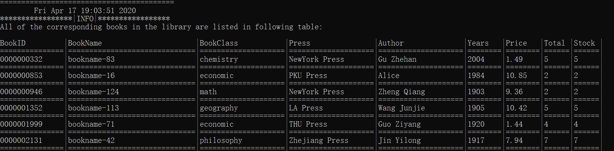<center>


### 5 程序运行测试

#### 5.1 开始界面

<center>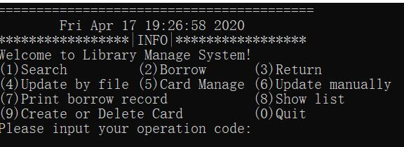<center>

此时只允许输入0~9之间的正整数，输入非法会报错如下：

<center><center>

#### 5.2 人工入库书籍

人工入库书籍需要依次指定需要入库书籍的属性，入库成功后会打印出数据库的变化信息。`new_ins`表示新插入书籍，`update`则表示已经存在的图书被更新了库存信息。插入书籍时不允许使用`ENTER`跳过信息输入，若输入中存在`ENTER`，程序会提示错误。

<center>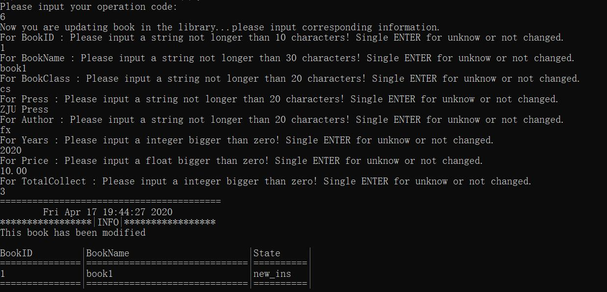<center>

可以通过`(8)show list`操作看到图书库中被插入了一本新的书籍，正是我们上面输入的书籍。

<center>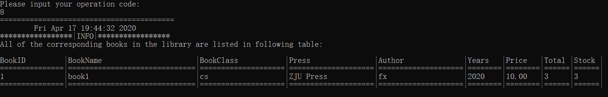<center>

#### 5.3 从文件批量入库

先试用数据生成器生成图书数据文件`data.csv`，其数据格式如下所示。此文件可以用Excel打开。

<center>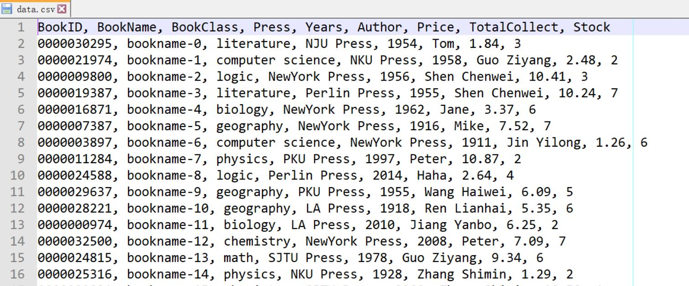<center>

然后通过`(4)Update By File`进行从文件批量入库图书，指定文件位置为`../data.csv`。

<center>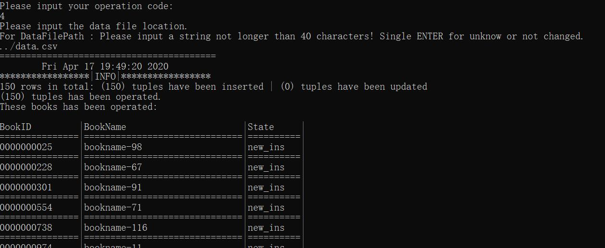<center>

可以看到信息提示一共检测到了150行数据，150行作为新图书插入了系统，没有发现重复的图书。紧接着程序提示了哪些图书是前后发生了变化的。然后我们通过`(8)show list`操作可以看到全部图书都已经插入了图书管理系统。

<center><center>

#### 5.4 创建和删除借书证

接下来我们选择`(9)Create or Delete Card`进行借书证的操作。首先我们创建一张借书证。输入相关的借书证信息，可以看到程序提示成功创建借书证。需要注意的是，`CardType`属性只能输入`teacher`或者`student`，否则程序会提示错误。

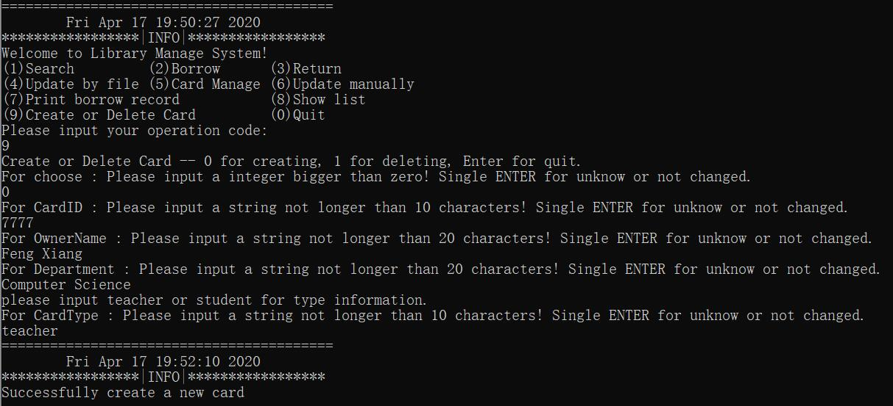

回到MySQL中，可以看到借书证被创建成功。

<center><center>

接下来我们选择删除借书证，输入想要删除的借书证卡号。

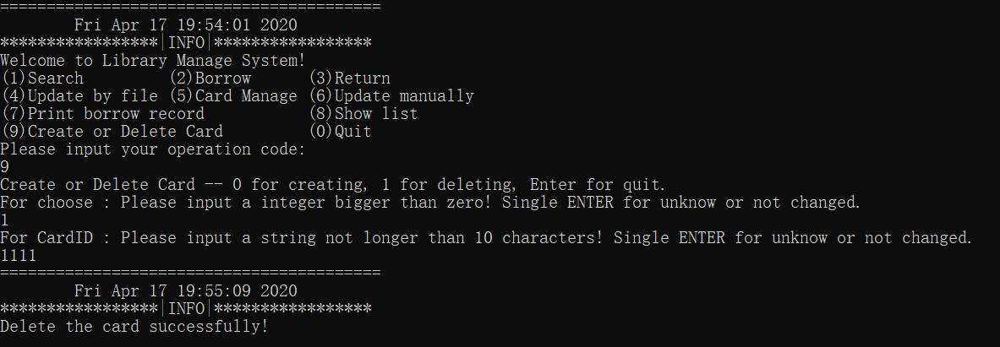

可以看到相应的借书证被删除了。

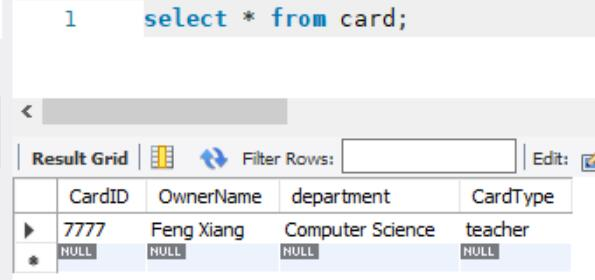

#### 5.5 借书

接下来我们测试`(2)Borrow`借书。

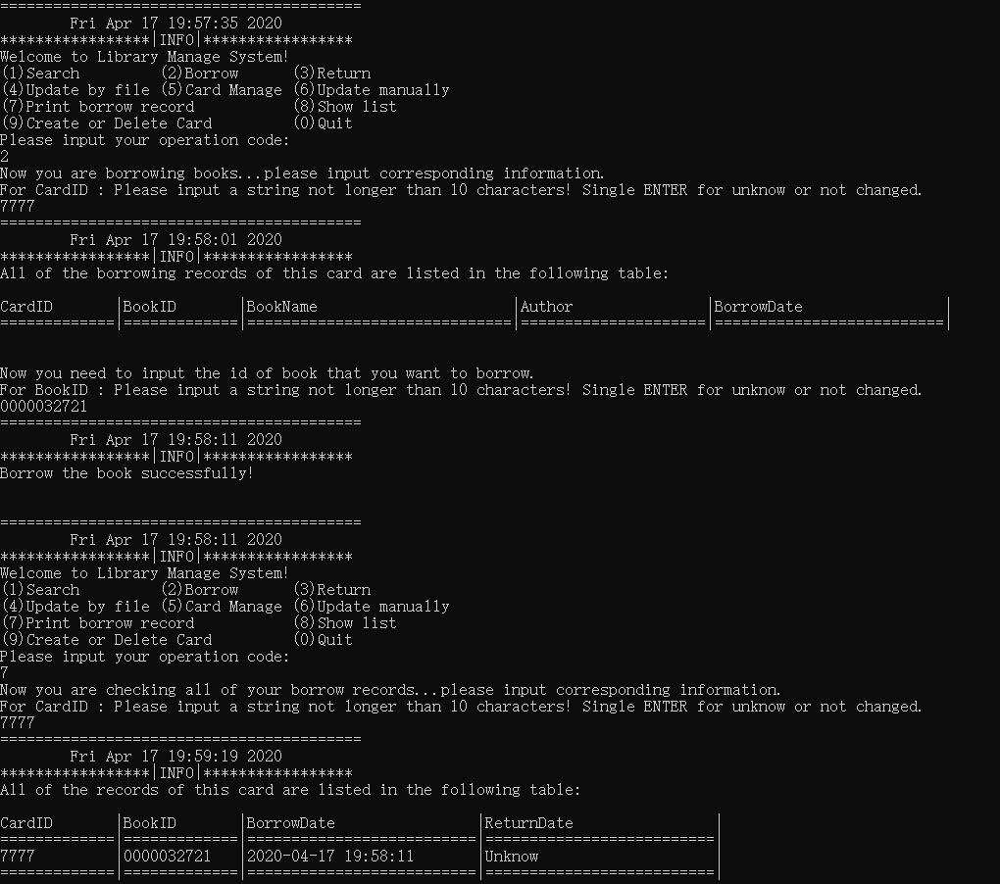

在上面的图中，我们先借阅了`BookID=0000032721`的图书，可以看到提示借阅成功。之后我们选择`(7)Print borrow record`打印这张卡的所有借阅记录。可以看到已经出现刚才的借阅记录了，但是由于我们还没有还书，`ReturnDate`还是`Unknow`状态。

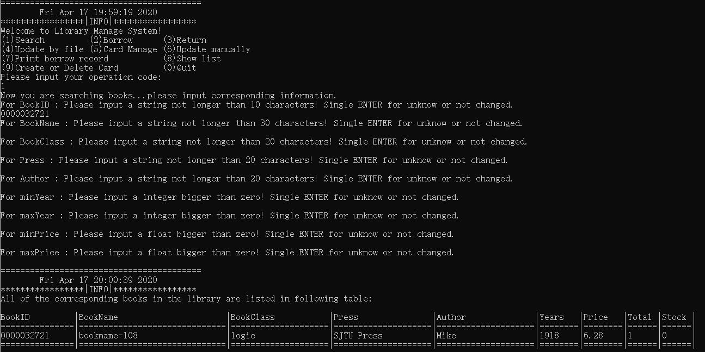

在上图中我们搜索该书，可以发现这本书的库存已经变为0了。那我们再来测试一下库存为0的时候能不能进行图书的借阅。

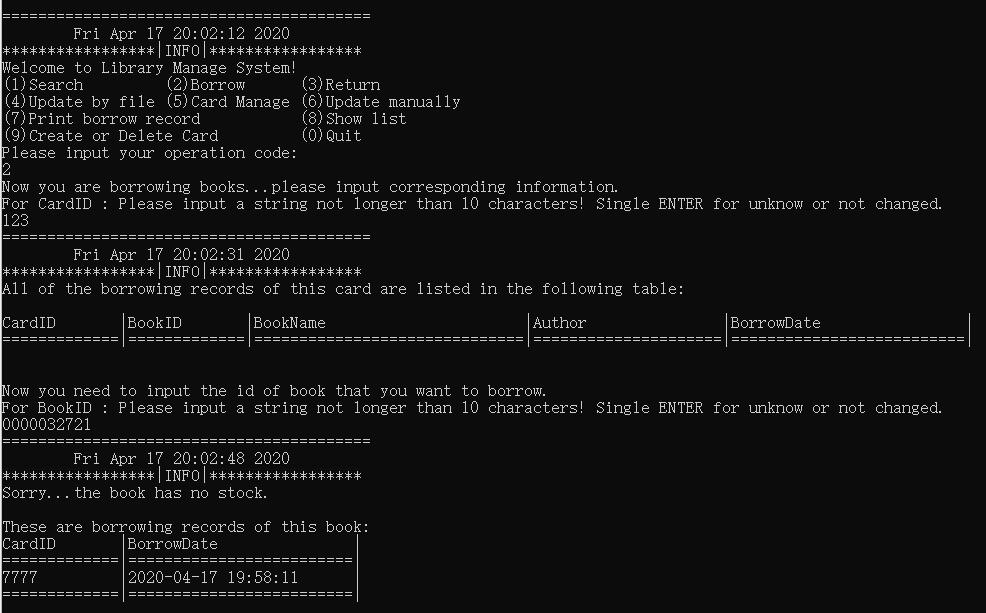

我们用另一张`CardID=123`的卡尝试借阅该书。但是程序提示这本书已经没有库存了，并且打印了这本书的正在借阅者。我们可以看到正是刚才`CardID=7777`的用户正在借阅这本书。

#### 5.6 还书

接下来我们测试`(3)Return`还书。我们首先输入想要还书的借书证卡号，然后程序会打印这张卡所有正在借阅的书籍。我们发现十分正确，因为有我们刚刚借的`0000032721`号书。这个时候我们选择这本书进行还书，程序提示还书成功。我们再次打印这张卡的所有借书记录，可以看到本来为`unknow`的`ReturnDate`被填上了刚才还书的时间。


当然，这本书的库存也被同时更新了。

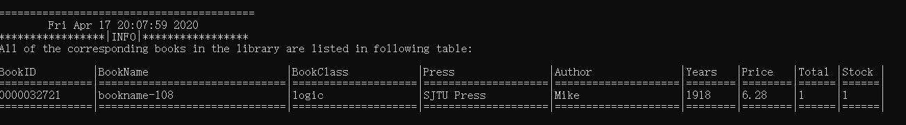

#### 5.7 修改借书证属性

有些时候，我们需要修改借书证信息。这时候就需要`(5)CardManage`操作。输入我们需要修改信息的借书证卡号，程序会打印这张借书卡的所有属性。我们将这张卡的`CardType`修改为`student`。


可以看到，`Card`表中的借书卡属性已经发生修改。

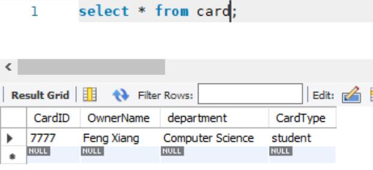

#### 5.8 图书查询

本程序支持键入回车直接跳过该筛选条件，同时支持区间搜索。我们测试一下搜索价格在`[10.00,20.00]`和发行日期在`[1950,1980]`的书籍。可以看到测试非常成功。

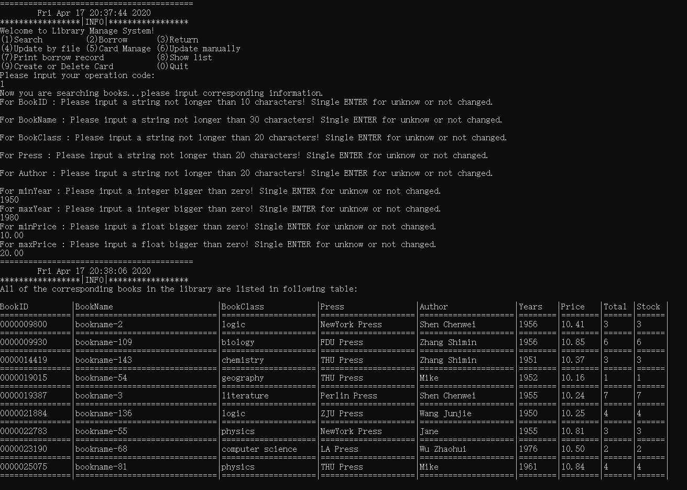

### 6 心得体会

我认为这次实验最有价值的就是让我们学会了如何用外部程序和数据库之间进行交互。有了这个基础，在之后的实践中，开发服务端程序就有了最起码的头绪和经验，极其有用。另外，虽然笔者设计的图书管理系统完善了很多边沿情况，会有各种的错误提示，但是基于篇幅原因没有全部给与展示，更多细节请参见源代码。最后，用ODBC写这样的程序极大地锻炼了我抗折磨的心态，多亏了它我掌握了在几乎没有参考资料的情况下自己啃文档的能力，不过感谢归感谢，以后还是用java写数据库交互吧。